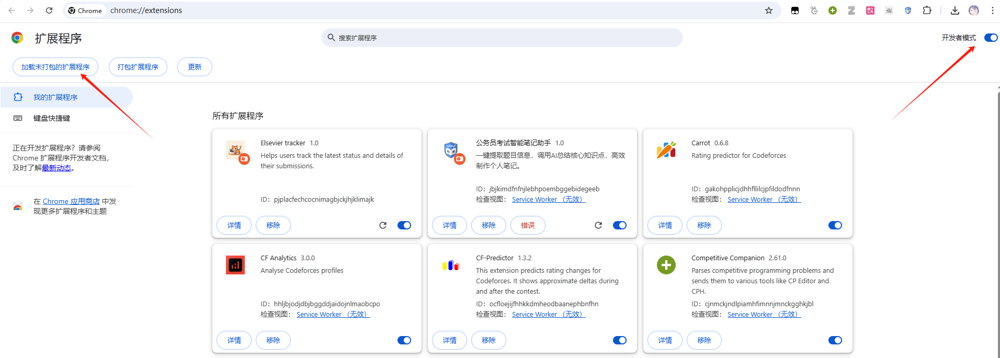
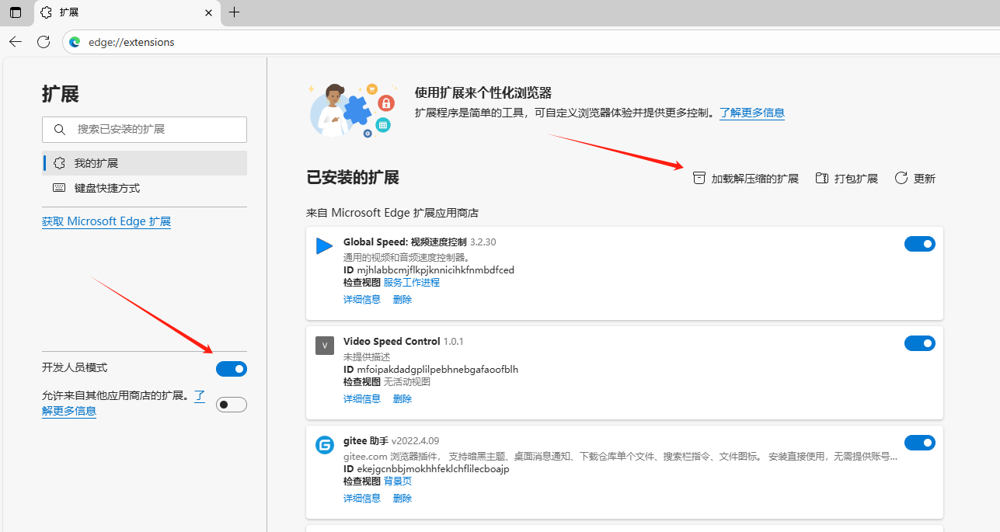
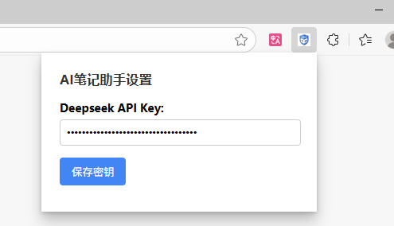
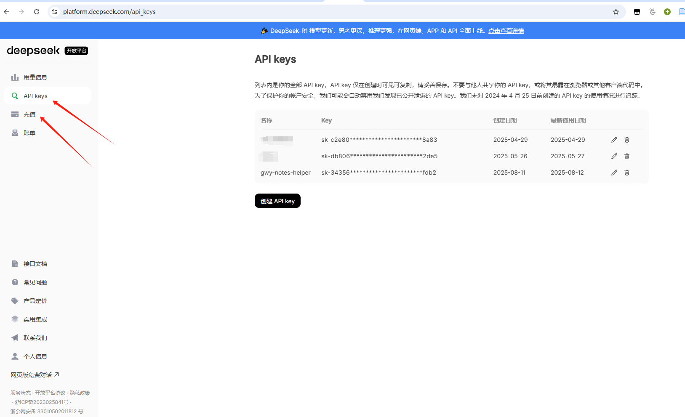
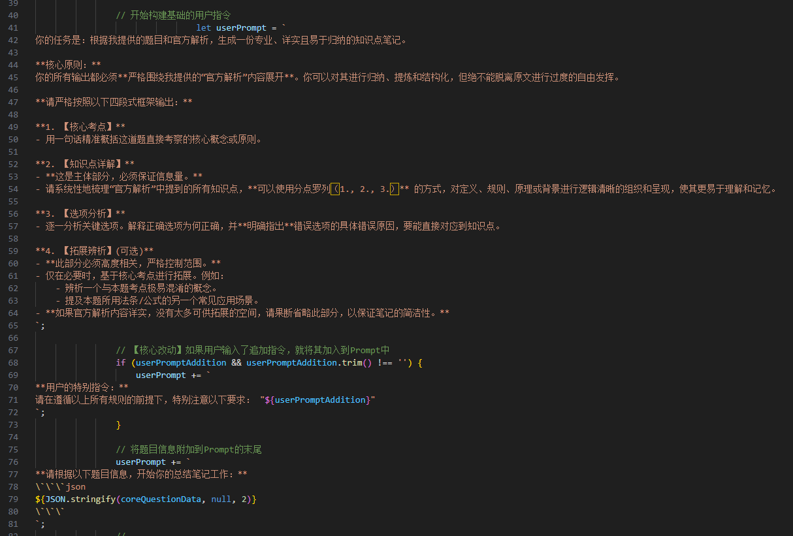
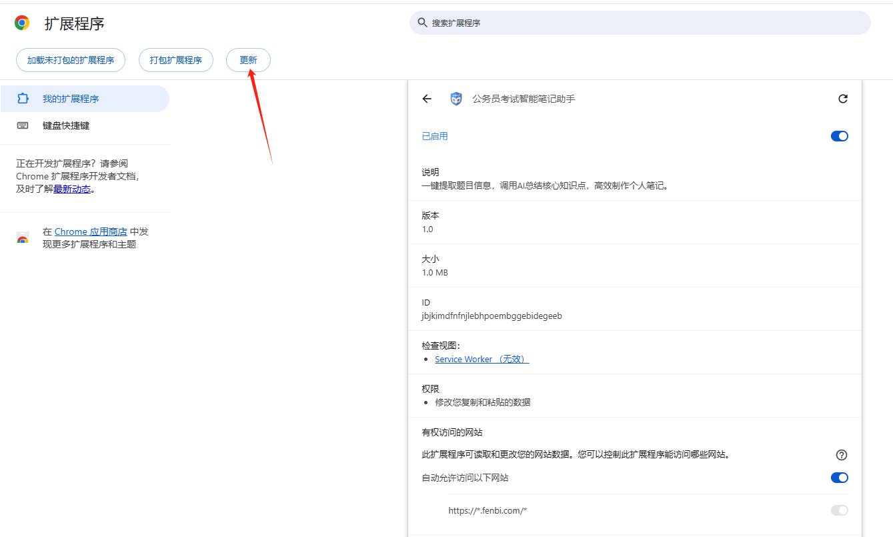

# 行测智能笔记小助手 (Gwy-Notes-Helper)

## 🚀 项目简介

这是一款功能强大的浏览器插件，能够通过网页DOM元素**一键抓取**您在“粉笔网”在线刷题平台上遇到的**纯文字**题目信息，利用**大语言模型（LLM）API**的强大分析能力，结合题干、官方解析、大模型思考及拓展，将其**智能地总结**为一份高度结构化、精炼详实、便于复习的知识点笔记，并以优雅（并不）的格式呈现在您眼前。

从此，告别繁琐的手动复制粘贴以及冗长的题目解析，让AI成为您最高效的备考伙伴。

**注：**

* 本插件不适用于题干或解析含有图文混排的题目，例如资料分析、含有tex公式图片的数量关系题目、图推等等，这种情况还是看官方解析或者老老实实手动截图问大模型吧
* 部分情况下报错请刷新页面后重新点击总结，点击后长时间没反应可能是DS官网崩了，服务器繁忙

**插件效果：**

## ✨ 主要功能

- **一键智能分析**：在题目解析页面，自动注入操作按钮，一键启动分析流程。
- **全方位信息提取**：精准抓取题干、选项、正确答案、官方解析、考点标签、题目来源等所有页面元素。
- **集成大模型API**：
  - 深度集成大语言模型（LLM）API， **目前只适配了DeepSeek** 。
  - 内置经过多轮迭代优化过的Prompt，力求精炼简洁且不丢失信息量。
- **高级交互功能**：
  - 支持用户在总结前**追加**追加自己的指令或问题，对AI的输出进行微调，实现个性化分析。
  - 采用**流式输出（Streaming）**，AI的回答会像打字机一样逐字显示，带来流畅、即时的交互体验。
- **优雅的前端渲染**：
  - 使用 **Marked.js** 将AI返回的Markdown笔记渲染成漂亮的富文本。
  - 通过 **DOMPurify** 对渲染内容进行安全净化，杜绝XSS风险。
  - 采用精心设计的CSS样式，实现了类似**Notion**的清爽、专业、易读的视觉风格。
- **良好兼容性**：支持Chrome, Edge等多种现代浏览器。

## 🚀 如何使用

1. **下载仓库**：点击本页面右上角的 `Code` -> `Download ZIP`，下载并解压。或者使用`git clone`克隆本仓库。
2. **打开扩展程序页面**：在您的浏览器地址栏输入 `chrome://extensions` (Chrome) 或 `edge://extensions` (Edge)。
3. **开启开发者模式**：在页面右上角，找到并打开“开发者模式”的开关。
4. **加载插件**：点击页面左上角的“加载已解压的扩展程序”按钮，然后选择您刚刚解压的项目文件夹。
5. **配置API Key**：
   - 插件图标会出现在浏览器右上角的工具栏中。
   - 点击图标，在弹出的窗口中输入您从DeepSeek等平台获取的API Key，然后点击保存。
6. **开始使用**：访问支持的刷题网站（如粉笔网的题目解析页），插件会自动注入功能按钮，开始您的智能复习之旅！

* Chrome添加插件方法：

* Edge添加插件方法：

* 添加API Key

* API Key获取方法：

  Deepseek开放平台：https://platform.deepseek.com/usage

  目前只适配了Deepseek官网的接口，为了平衡性能和响应速度与价格因素，本插件调的接口是Deepseek-V3，便宜量大

  获取Deepseek Key需要充值少量rmb，实测调用了40次花费仅 $0.18$ ，所以充5~10块钱就能用挺久了

  新建key后点击插件图标保存即可，本插件将key保存在浏览器缓存，请妥善保存，不要与他人共享你的 API key。

## 🛠️ 自定义修改

如果有自定义初始Prompt需求的同学，可以在background.js相应位置修改即可，修改后移除并重新加载插件（Key也要重新填），也可以直接更新插件（文件夹路径不要变动）

需要将模型变更为DeepSeek-R1的话，同样在background.js中将 "deepseek-chat" 改为 "deepseek-reasoner"即可

本地修改后需要更新插件：

## ⚖️ 免责声明 (Disclaimer)

在使用本插件前，请您务必仔细阅读并充分理解以下所有条款。**一旦您安装、使用本插件，即表示您已同意并接受本声明的全部内容。**

1. **【独立性质】**
   本插件是基于个人兴趣开发的**独立第三方工具**，旨在为用户提供学习辅助。本插件与“粉笔网”（Fenbi.com）或任何其他在线刷题平台**没有任何形式的关联、授权或官方认可**。本插件的开发与“粉笔网”官方无关。
2. **【使用目的】**
   本插件仅限于用户**个人的学习与研究目的**。严禁将本插件用于任何商业用途或任何可能侵犯第三方权益的行为。
3. **【内容准确性】**
   AI生成的笔记总结仅作为辅助学习和快速归纳的参考，**不保证其内容的绝对准确性、完整性或时效性**。所有知识点请以官方提供的解析为最终依据。因使用本插件生成的笔记内容而导致的任何学习或考试失误，开发者概不负责。
4. **【API费用与责任】**
   本插件需要用户自行提供第三方大语言模型（如DeepSeek）的API密钥。您将对您API密钥下产生的所有**网络请求和费用**负全部责任。请妥善保管您的密钥，并关注其使用量。开发者不承担任何因API使用而产生的费用。
5. **【知识产权】**
   本插件仅对用户在浏览器中合法访问到的页面内容进行临时性的信息提取和分析。页面中的题目、解析等原始内容的**知识产权归属于其原始平台**。本插件尊重并保护知识产权，不会存储、分发或利用这些内容。
6. **【软件稳定性与“按原样”提供】**
   本插件是“按原样”（as is）提供的，不提供任何明示或暗示的保证。由于目标网站的前端代码可能会随时更新，本插件的某些或全部功能**可能随时失效**。开发者不保证会持续提供更新或维护。
7. **【责任限制】**
   在任何情况下，开发者均不对因使用或无法使用本插件而导致的任何直接、间接、偶然、特殊或后果性的损害承担责任。
